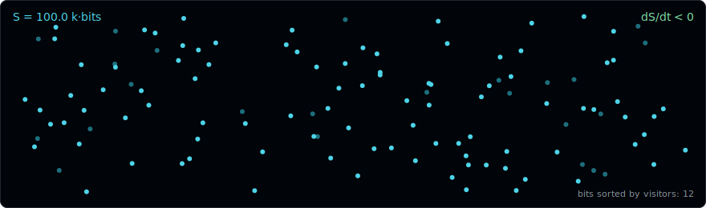

<div align="center">

# Reversing the irreversible

*Rev. Steven Milanese — the second law is statistical, not sacred. The demon pays its bills in bits.*

</div>

<div align="center">
  

  [⚡ Be the demon — sort 12 bits](https://github.com/developtheweb/developtheweb/issues/new?title=demon%3A+sort+12+bits&body=One+tap.+Submit+to+sort.)

  <sub>Each click opens a one-tap issue; an Action sorts the field, recommits the SVG, closes the issue. This README's state is community-lowered entropy.</sub>
</div>

## About the Reverend

```
Reverend ≔ Physicist ⊗ Minister ⊗ Systems_Alchemist
domain    : ℝ³·¹ ⊗ CY₃(χ = ±6)
axiom     : complexity ⟼ elegance
method    : ∀ p ∈ Inconceivable — solve(p) ∨ pose(better_p)
runtime   : Arch Linux, btw
```

*Written in MPL — the author's own language. Ordained minister, autodidactic polymath, natural philosopher. The ministry and the physics are the same inquiry conducted at different energy scales.*

## The mission — goals inconceivable by design

<table>
<tr>
<td width="50%" valign="top">

**Reverse the irreversible**

Maxwell's demon on GitHub's own infrastructure, funded in Landauer's currency. *(running above)*

</td>
<td width="50%" valign="top">

**Derive the three generations**

Calabi–Yau compactifications, χ = ±6. [ORCID](https://orcid.org/0009-0008-0442-208X) · [OSF](https://osf.io/3tsd4/) · [companion essays](https://stevenmilanese.com/blog/tag/calabi-yau-manifolds)

</td>
</tr>
<tr>
<td width="50%" valign="top">

**Cognitive universality**

[MPL](https://github.com/developtheweb/mpl): if you can write the equation, you can run it.

</td>
<td width="50%" valign="top">

**Planetary intelligence**

Earth as information processor, argued in full on [Strange Quarks](https://stevenmilanese.com/blog/planetary-intelligence-earth-as-information-processor).

</td>
</tr>
</table>

<!-- STATS:START -->
<div align="center">

`10¹⁰⁶ yr until heat death — the deadline` · `2.9 zJ of order per bit sorted (kT ln 2, 300 K)` · `★ 27 stars across 14 public repos`

</div>
<!-- STATS:END -->

## Beneath the physics — the verified inventory

<!-- FEATURED:START -->
<div align="center">
<table>
<tr>
<td width="50%" valign="top">
<h3 align="center"><a href="https://github.com/developtheweb/anthropic-certs">anthropic-certs</a></h3>
<p align="center"><code>★ 11</code></p>
<p align="center">Verified Anthropic certifications — Claude, API, Claude Code CLI, MCP.</p>
</td>
<td width="50%" valign="top">
<h3 align="center"><a href="https://github.com/developtheweb/slTrain">slTrain</a></h3>
<p align="center"><code>★ 4</code></p>
<p align="center">A steam locomotive for your terminal, smoke trail included.</p>
</td>
</tr>
<tr>
<td width="50%" valign="top">
<h3 align="center"><a href="https://github.com/developtheweb/meowchi-releases">meowchi-releases</a></h3>
<p align="center"><code>★ 4</code></p>
<p align="center">A desktop pet that evolves when you actually get work done.</p>
</td>
<td width="50%" valign="top">
<h3 align="center"><a href="https://github.com/developtheweb/mpl">mpl</a></h3>
<p align="center"><code>★ 2</code></p>
<p align="center">Mathematics Programming Language — write the equation, run the equation.</p>
</td>
</tr>
</table>
</div>
<!-- FEATURED:END -->

## Latest from Strange Quarks

<!-- FEED:START -->
| Article | |
|:---|---:|
| [Mathematical Programming Language: A Vision for Cognitive Universality Through Unicode-Based Syntax](https://stevenmilanese.com/blog/mathematical-programming-language-a-vision-for-cognitive-universality-through-unicode-based-syntax) | Jul 28, 2025 · 17 min read |
| [The Ultimate Easter Egg Hunt: An Online Odyssey for the Brilliant Minds](https://stevenmilanese.com/blog/gunter) | Jul 21, 2025 · 45 min read |
| [The Architect of Acquiescence](https://stevenmilanese.com/blog/the-architect-of-acquiescence) | Jun 25, 2025 · 11 min read |
| [Planetary Intelligence: Earth as Information Processor](https://stevenmilanese.com/blog/planetary-intelligence-earth-as-information-processor) | Jun 18, 2025 · 49 min read |
<!-- FEED:END -->

<div align="center">
  <br>
  <picture>
    <source media="(prefers-color-scheme: dark)" srcset="https://raw.githubusercontent.com/developtheweb/developtheweb/output/github-contribution-grid-snake-dark.svg" />
    <source media="(prefers-color-scheme: light)" srcset="https://raw.githubusercontent.com/developtheweb/developtheweb/output/github-contribution-grid-snake.svg" />
    
  </picture>
</div>

---

<table width="100%">
<tr>
<td align="left">

*Founder, [MoonFactory](https://moonfactory.dev) — development and consulting.*

</td>
<td align="right">

[stevenmilanese.com](https://stevenmilanese.com) · [Strange Quarks](https://stevenmilanese.com/blog) · [X](https://x.com/developtheweb) · [LinkedIn](https://www.linkedin.com/in/stevenmilanese/) · [ORCID](https://orcid.org/0009-0008-0442-208X) · [OSF](https://osf.io/3tsd4/) · [rev@moonfactory.dev](mailto:rev@moonfactory.dev)

</td>
</tr>
</table>
