<div align="center">
  
  <!-- Animated Wave -->
  
  
  <!-- Logo with Animation -->
  
  
  <!-- Animated Typing Header -->
  [](https://git.io/typing-svg)
  
  <!-- Profile Views Counter -->
  <br>
  
  
  <!-- Social Badges with Custom Colors -->
  <br><br>
  [](https://stevenmilanese.com)
  [](https://www.linkedin.com/in/stevenmilanese/)
  [](https://stevenmilanese.com/strange-quarks)
  <br>
  [](https://x.com/developtheweb)
  [](https://t.me/CodeAndVerse)
  [](mailto:dev@level.host)
  <br>
  [](https://orcid.org/0009-0008-0442-208X)
  [](https://osf.io/3tsd4/)
</div>

<!-- Animated Banner -->
<div align="center">
  
</div>

<!-- Quote Section -->
<div align="center">
  <br>
  
  <br>
</div>

## 🎯 About Me

```python
class StevenMilanese:
    def __init__(self):
        self.title = "Autodidactic Polymath | Systems Alchemist"
        self.location = "🌍 Earth"
        self.current_focus = ["AI Architecture", "Quantum Computing", "WebGL", "Spiritual Tech"]
        self.philosophy = "Bridge technical excellence with human experience"
        
    def transform_challenges(self, problem):
        return f"✨ Inspired solution for {problem}"
```

I transform complex challenges into inspired technological solutions. By seamlessly integrating Artificial Intelligence with cutting-edge development practices, I create systems that push the boundaries of what's possible. My expertise spans multiple domains including theoretical physics, mathematics, AI systems architecture, and spiritual technology.

## 🚀 Tech Arsenal

<div align="center">
  
### Languages & Frameworks


### Tools & Technologies


</div>

## 📊 GitHub Analytics

<div align="center">
   
  
</div>

<div align="center">
  
</div>

## 🎨 Featured Projects

<div align="center">
  <table>
    <tr>
      <td width="50%">
        <h3 align="center">stevenmilanese.com</h3>
        <div align="center">
          <a href="https://stevenmilanese.com" target="_blank"></a>
          <br><br>
          <p><strong>Immersive Portfolio Experience</strong></p>
          <p>Three.js visualizations • Server-side rendering • Headless CMS</p>
          <p>
            [](https://stevenmilanese.com)
          </p>
        </div>
      </td>
      <td width="50%">
        <h3 align="center">Emergence Intelligence</h3>
        <div align="center">
          <a href="https://stevenmilanese.com/#projects" target="_blank"></a>
          <br><br>
          <p><strong>Advanced AI System</strong></p>
          <p>Cognitive architecture • Semantic processing • Episodic memory</p>
          <p>
            [](https://stevenmilanese.com/#projects)
          </p>
        </div>
      </td>
    </tr>
  </table>
</div>

## 📚 Latest Articles

<div align="center">
  
| 📝 Article | 🏷️ Topics |
|:---|:---|
| [The Intersection of Physics and AI](https://stevenmilanese.com/strange-quarks) | `Quantum Computing` `Machine Learning` `Physics` |
| [Building Resilient Distributed Systems](https://stevenmilanese.com/strange-quarks) | `Architecture` `Scalability` `DevOps` |
| [WebGL Performance Optimization Techniques](https://stevenmilanese.com/strange-quarks) | `WebGL` `Three.js` `Performance` |
| [Quantum Computing: Practical Applications](https://stevenmilanese.com/strange-quarks) | `Quantum` `Algorithms` `Future Tech` |

</div>

## 🔭 Current Focus

```mermaid
graph LR
    A[Advanced 3D Visualizations] --> B{Current Projects}
    C[Serverless Architecture] --> B
    D[Quantum Computing + AI] --> B
    E[Spiritual Technology] --> B
    B --> F[🚀 Innovation]
```

<div align="center">
  


</div>

## 🏆 Achievements & Certifications

<div align="center">
  
  
  
  
</div>


## 💫 Connect & Collaborate

<div align="center">
  
  
  <br><br>
  
  [](https://stevenmilanese.com)
  [](https://www.linkedin.com/in/stevenmilanese/)
  [](mailto:dev@level.host)
  [](https://stevenmilanese.com/strange-quarks)
</div>

<!-- Snake Animation -->
<div align="center">
  <br>
  <picture>
    <source media="(prefers-color-scheme: dark)" srcset="https://raw.githubusercontent.com/developtheweb/developtheweb/output/github-contribution-grid-snake-dark.svg" />
    <source media="(prefers-color-scheme: light)" srcset="https://raw.githubusercontent.com/developtheweb/developtheweb/output/github-contribution-grid-snake.svg" />
    
  </picture>
</div>

---

<div align="center">
  
  <br>
  
  <br>
  <sub>⚡ Powered by curiosity, driven by innovation</sub>
</div>

<!-- Wave Footer -->

